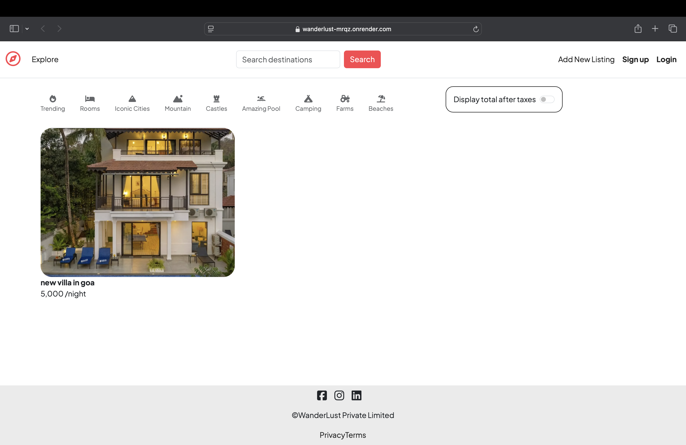
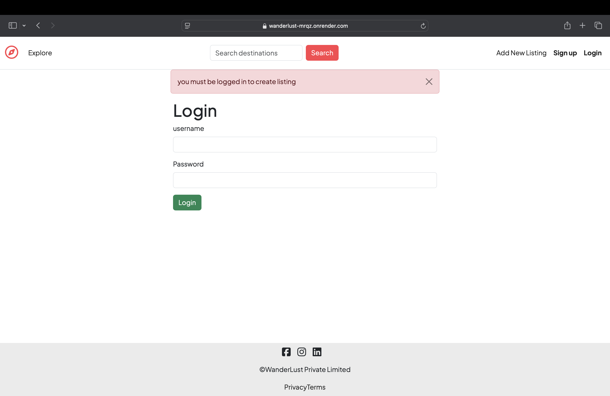
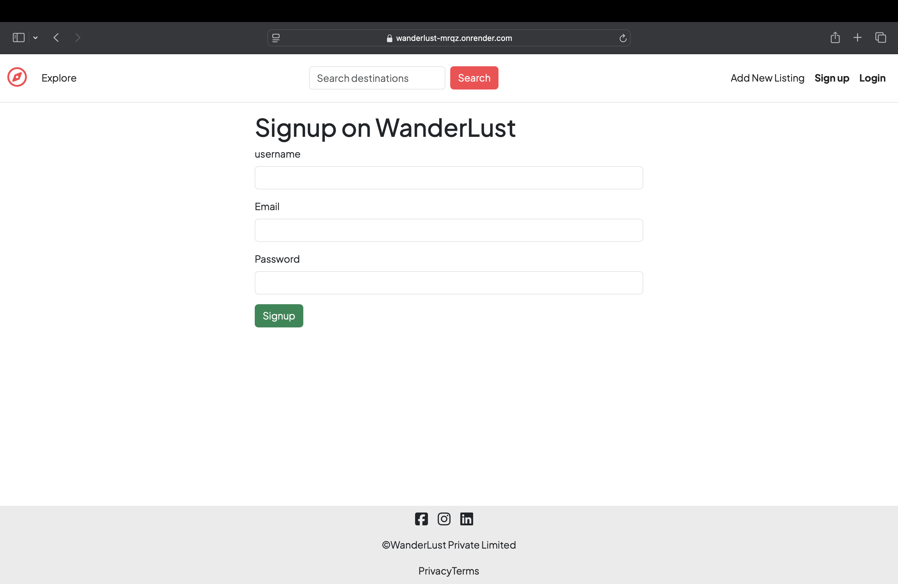
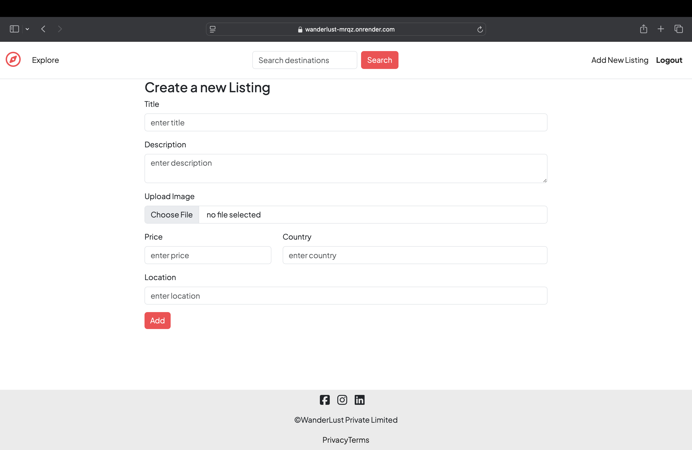

# 🏨 WanderLust – Hotel Booking Portal  

A full-stack hotel booking platform where users can explore properties, view details, and book stays.  
It includes authentication, listing management, and an intuitive UI for a smooth booking experience.  

🚀 **Live Demo:** [WanderLust on Render](https://wanderlust-mrqz.onrender.com/listings) 

---

## ✨ Features  
- 🔐 User Authentication (Signup/Login/Logout)  
- 🏠 Add, View, and Manage Property Listings  
- 🖼️ Image Upload for Listings  
- 🔎 Search by destination and filters (pool, mountain, farm, etc.)  
- 💰 Price per night with tax toggle option  
- 📱 Responsive UI  

---

## 🛠️ Tech Stack  
- **Frontend:** HTML, CSS, Bootstrap, JavaScript  
- **Backend:** Node.js, Express.js  
- **Database:** MongoDB  
- **Other Tools:** Render (Deployment), GitHub  

---

## 📸 Screenshots  

### 🏠 Explore Listings  
  

### 🔑 Login Page  
  

### 📝 Signup Page  
  

### ➕ Create New Listing  
  

---

## ⚙️ Installation  

1. Clone the repository:  
   ```bash
   git clone https://github.com/shubhi3499/wanderlust.git
   cd wanderlust
2.Install dependencies:
npm install

3.Create a .env file and add your MongoDB connection string & session secret:
MONGO_URI=your-mongodb-uri
SESSION_SECRET=your-secret

4.Run the app locally:
npm start

5.Open http://localhost:3000
 in your browser.

 Future Improvements

📅 Add booking & reservation system

💳 Payment gateway integration

🌍 Advanced search with geo-location
